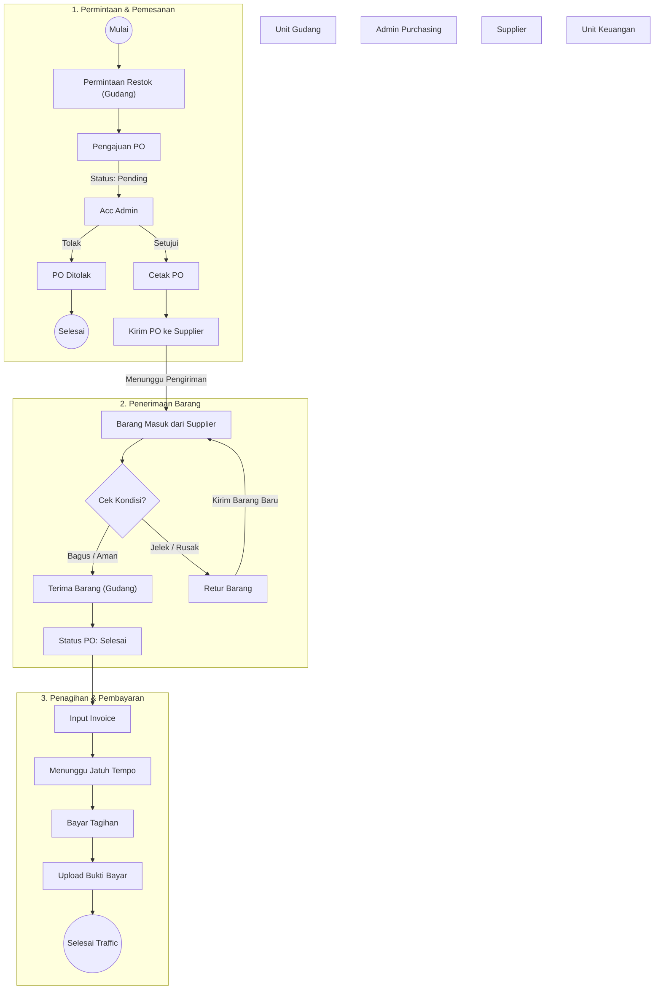

# Alur Pengadaan & Persediaan Barang (Procurement & Inventory)

## Penjelasan Alur

1.  **Permintaan Restok**: Gudang mengajukan via menu PO Barang.
2.  **Konfirmasi**: Admin Acc di menu Konfirmasi PO. Jika oke, status "Diterima" -> PO dicetak & dikirim.
3.  **Barang Masuk**:
    - **Kondisi Bagus**: Diterima Gudang -> Status PO "Selesai".
    - **Kondisi Jelek**: Ajukan Retur -> Tunggu barang pengganti -> Cek ulang -> Diterima.
4.  **Pembayaran**:
    - Status PO Selesai membuka akses untuk **Input Invoice**.
    - Pembayaran dilakukan sesuai Tempo.
    - Bukti bayar diupload untuk menyelesaikan flow.
