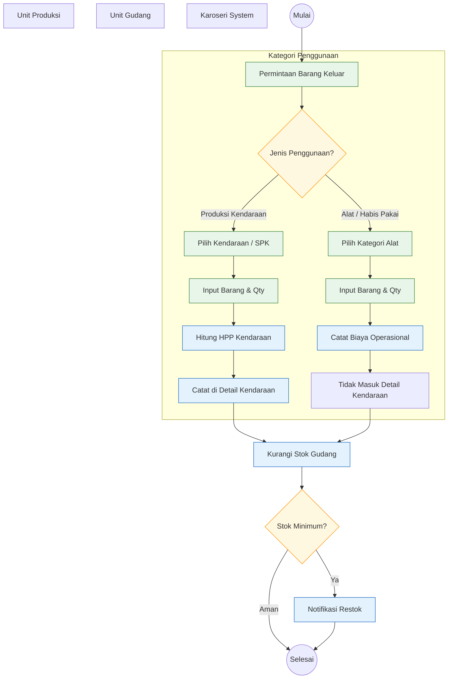

# Alur Penggunaan Barang (Material Usage)

## Penjelasan Alur

1.  **Identifikasi Penggunaan**: Barang keluar dibagi menjadi dua jalur utama.
    - **Produksi Kendaraan**: Untuk bahan baku yang menempel pada unit (misal: Plat, CNP, Cat untuk unit X). Ini **wajib** memilih Kendaraan tujuan agar biaya tercatat dalam HPP unit tersebut.
    - **Alat / Habis Pakai**: Untuk alat kerja (misal: Kawat Las, Gerinda, Sarung Tangan) yang sifatnya umum. Biaya ini masuk ke Biaya Operasional/Overhead dan **tidak** dibebankan spesifik ke satu unit kendaraan tertentu secara langsung.
2.  **Pencatatan**:
    - Material Kendaraan -> Muncul di "Detail Kendaraan" -> Akumulasi HPP.
    - Alat -> Tercatat sebagai pengeluaran gudang biasa.
3.  **Inventaris**: Kedua jalur akan mengurangi stok aktual di gudang.
