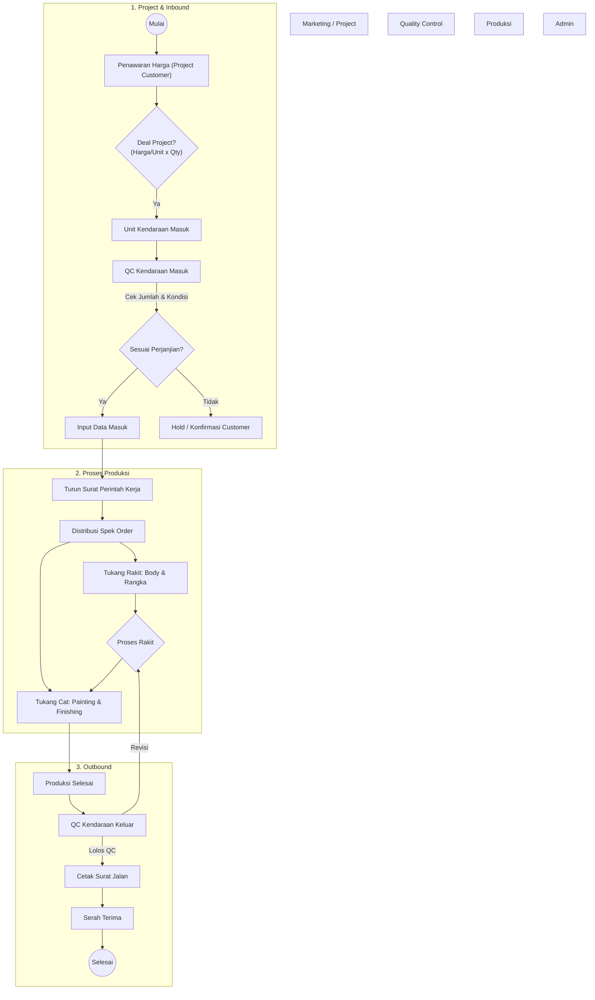
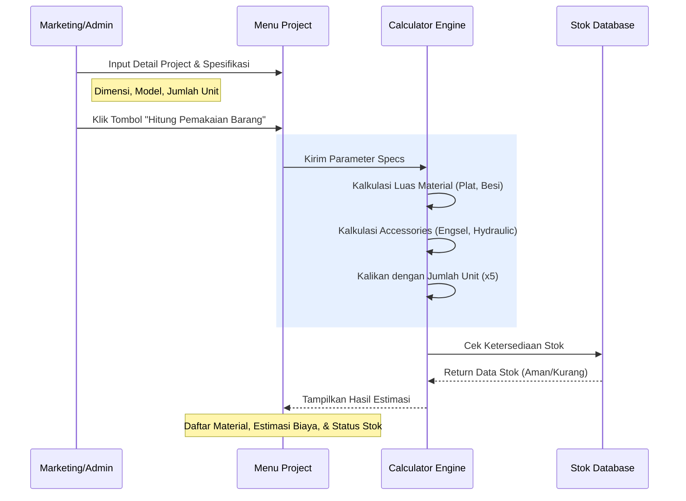

# Alur Manajemen Kendaraan & Fitur Core

## 1. Alur Produksi Kendaraan (End-to-End)

## 2. Fitur Core: Smart Planning (Hitung Pemakaian Barang)

Fitur ini berada di dalam menu **Project / Penawaran**. Tujuannya untuk mengestimasi modal (HPP) dan kebutuhan material secara otomatis berdasarkan spesifikasi teknis unit.

### Skenario Penggunaan

_User menginput data project baru:_

- **Customer**: PT. Citra Transport Logistic
- **Permintaan**: Wing Box (Hydraulic) - 5 Unit
- **Harga**: Rp 350.000.000 / Unit
- **Spesifikasi Teknis**:
  - Dimensi (PxLxT): 2700 x 2400 x 2750 mm
  - Pintu: 4 Pintu Samping (R/L)
  - Sayap: 4 Sayap

### Alur Sistem (Sequence Diagram)

### Output Fitur

Sistem akan menampilkan:

1.  **Daftar Material**: Rincian apa saja yang dibutuhkan (misal: Besi UNP 100 20btg, Plat 2mm 10lbr).
2.  **Status Stok**: Indikator apakah stok gudang mencukupi untuk project ini.
3.  **Rekomendasi**: Jika stok kurang, tombol untuk _Generate PO_ ke purchasing akan aktif otomatis.
