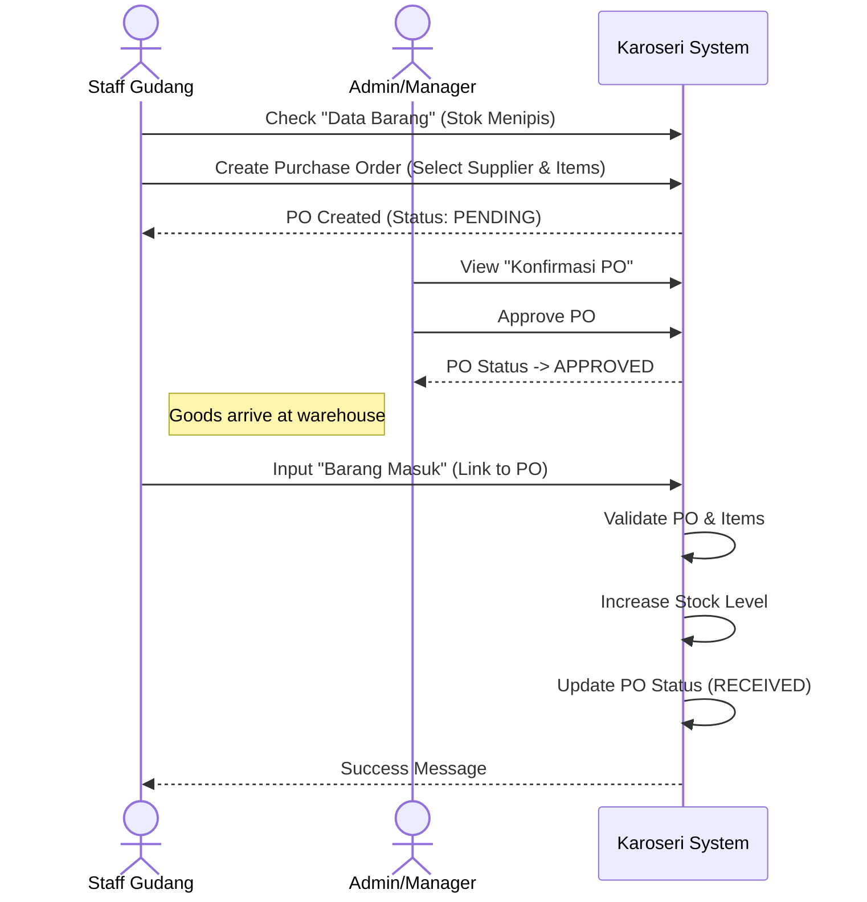
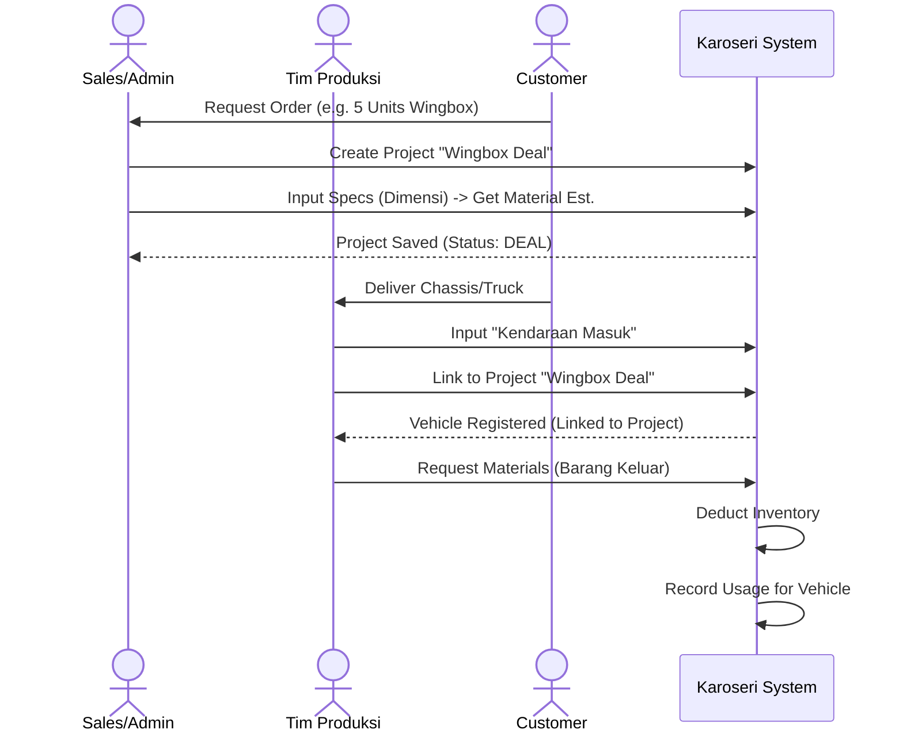
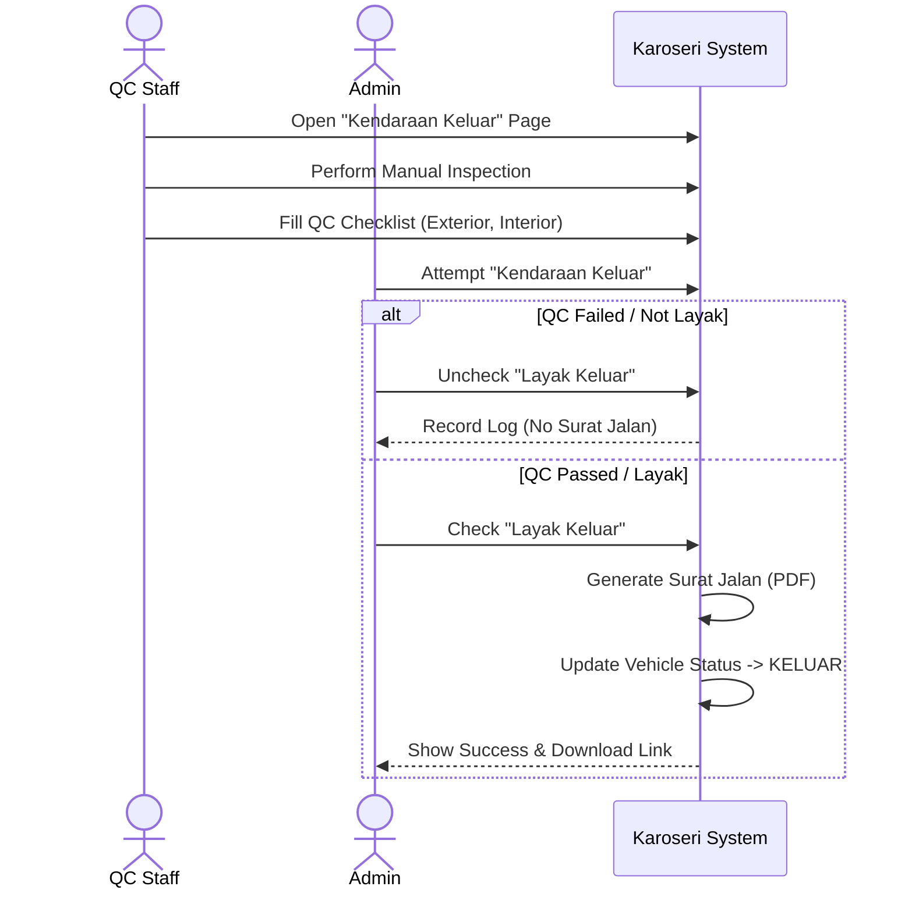

# Karoseri System - User Guide

Welcome to the **Karoseri System** user guide. This document provides step-by-step instructions for the end-to-end business processes, from procurement to vehicle delivery.

## Table of Contents

1.  [Flow 1: Procurement & Inventory](#flow-1-procurement--inventory)
2.  [Flow 2: Project & Production](#flow-2-project--production)
3.  [Flow 3: Quality Control & Delivery](#flow-3-quality-control--delivery)

---

## Flow 1: Procurement & Inventory

**Goal**: Ensure stock availability for production.

### Step-by-Step Guide

1.  **Check Stock**:
    - Go to **Manajemen Barang > Data Barang**.
    - Search for items. Red alerts indicate "Stok Menipis".
2.  **Request Restock (Purchase Order)**:
    - Go to **Manajemen Barang > Purchase Order**.
    - Click **"Buat PO Baru"**.
    - Select Supplier and add items (with quantity and price).
    - _System Status_: PO created with status `PENDING`.
3.  **Approve PO (Admin)**:
    - Go to **Manajemen Barang > Konfirmasi PO**.
    - Review pending POs. Click **"Approve"**.
    - _System Status_: PO updates to `APPROVED`.
4.  **Receive Goods (Barang Masuk)**:
    - When physical items arrive, go to **Manajemen Barang > Barang Masuk**.
    - Click **"Catat Barang Masuk"**.
    - Select the **Supplier** and the related **Approved PO**.
    - Input received quantity (Partial delivery is allowed).
    - _System Action_: Stock increases automatically. PO status updates to `RECEIVED` (if full) or remains `APPROVED` (if partial).

### Sequence Diagram (User Interaction)

---

## Flow 2: Project & Production

**Goal**: Deal with customer and manage vehicle production.

### Step-by-Step Guide

1.  **Create Project / Deal**:
    - Go to **Project & Estimasi**.
    - Click **"Buat Penawaran Baru"**.
    - Select Customer and input details (Description, Qty, Price).
    - **Smart Planning**: Input vehicle dimensions (L x W x H) to get material estimates.
    - Set status to `DEAL` when confirmed.
2.  **Inbound Vehicle (Kendaraan Masuk)**:
    - Go to **Manajemen Kendaraan > Form Kendaraan Masuk**.
    - Click **"Kendaraan Masuk"**.
    - Input vehicle details (Plate No, Brand).
    - **Link Project**: Select the Project/SPK created in Step 1.
    - Check typical defects/missing parts in the checklist.
3.  **Material Usage (Produksi)**:
    - Go to **Manajemen Barang > Barang Keluar**.
    - Click **"Catat Barang Keluar"**.
    - Select **Jenis: Produksi**.
    - Select the **Kendaraan** currently in production.
    - Add items used (e.g., Cat, Besi).
    - _System Action_: Stock decreases. Usage is recorded against the vehicle.

### Sequence Diagram (User Interaction)

---

## Flow 3: Quality Control & Delivery

**Goal**: Ensure quality and deliver vehicle to customer.

### Step-by-Step Guide

1.  **Finish Production**:
    - Ensure all work is done.
    - Update vehicle status to `SELESAI` (Currently manual or triggered by workflow).
2.  **Quality Control (QC)**:
    - Go to **Manajemen Kendaraan > Form Kendaraan Keluar**.
    - Find the vehicle. Click the **QC Checklist** icon.
    - Inspect all areas (Exterior, Interior, Safety).
    - Mark items as `Baik`, `Rusak`, or `Perlu Perbaikan`.
3.  **Generate Delivery Order (Surat Jalan)**:
    - In **Form Kendaraan Keluar**, click **"Kendaraan Keluar"**.
    - Input date.
    - **Validation**: You MUST check **"Layak Keluar"** (Pass QC).
    - If checked, the system generates a **Surat Jalan**.
    - If NOT checked (Failed QC), the system records the attempt but **blocks** the Surat Jalan.

### Sequence Diagram (User Interaction)

